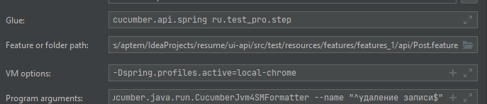

# FOR RUN APPLICATION PUT:
    вставить в VM options, чтобы запускать из idea  

    run chrome driver
    mvn clean verify -Dspring.profiles.active=local-chrome (запуск из консоли)
    
    run firefox driver
    mvn clean verify -Dspring.profiles.active=local-firefox

